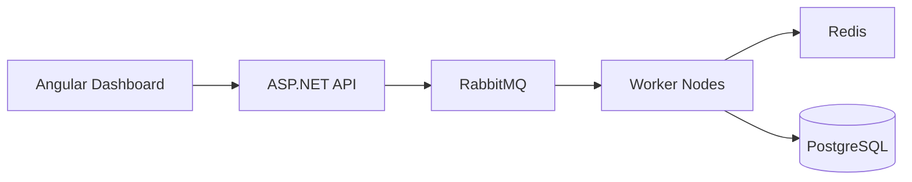

# ReliableBack
#v 1.7.0


Distributed background job processing system for .NET.

ReliableBack is a custom-built background task processing platform inspired
by Hangfire and Celery, focused on reliability, retry orchestration,
distributed locking, observability, and horizontal scalability.

## Tech Stack

.NET 8 · ASP.NET Core · EF Core · Dapper · MediatR (CQRS) · RabbitMQ ·
Redis (Pub/Sub) · PostgreSQL · SignalR · Angular · Docker Compose ·
OpenTelemetry · Serilog · xUnit · Testcontainers · GitHub Actions CI



## Why?

Most pet projects demonstrate CRUD operations.

ReliableBack focuses on real-world distributed systems challenges:

- Reliable background job execution
- Retry orchestration
- Horizontal scaling
- Worker coordination
- Dead-letter handling
- Job scheduling
- Real-time monitoring
- Observability and tracing

The goal is to explore how systems like Hangfire, Celery, Sidekiq,
and Temporal work internally.

## Features

- Distributed job processing across multiple worker instances
- Priority queues — High, Normal, Low
- Delayed and scheduled jobs
- Retry with exponential backoff
- Dead-letter queue after max retries exceeded
- Watchdog service — recovers stalled tasks after worker crash
- Redis Pub/Sub for real-time status propagation
- SignalR dashboard — live task status updates
- OpenTelemetry distributed tracing across API and Worker
- Structured logging with Serilog and Correlation IDs
- Health checks for PostgreSQL, RabbitMQ, Redis
- Prometheus metrics + Grafana dashboards
- Horizontal worker scaling via Kubernetes
- Docker Compose for local development
- GitHub Actions CI with unit and integration tests
- Testcontainers for integration testing with real infrastructure

## Architecture

ReliableBack follows Clean Architecture with DDD principles:

```
ReliableBack.Domain          → Entities, Value Objects, Domain Events
ReliableBack.Application     → CQRS Commands/Queries, MediatR, Interfaces
ReliableBack.Infrastructure  → EF Core, Dapper, RabbitMQ, Redis, Postgres
ReliableBack.API             → ASP.NET Core, Controllers, SignalR, Middleware
ReliableBack.Worker          → BackgroundService, WatchdogService
ReliableBack.Tests           → Unit + Integration tests
```

### Task Lifecycle

```
POST /api/tasks
    → TaskItem created (Pending)
    → Published to RabbitMQ queue (tasks.high / tasks.normal / tasks.low)
    → Status: Queued

Worker consumes message
    → Status: Running
    → On success: Completed
    → On failure: RetryCount++, ScheduledAt = UtcNow + exponential backoff
        → Status: Retrying
        → Watchdog requeues when ScheduledAt reached
        → After MaxRetries: DeadLettered

Every status change
    → Published to Redis Pub/Sub
    → SignalR Hub broadcasts to Angular dashboard
    → OpenTelemetry span recorded
```

### Retry Strategy

Exponential backoff with a base delay of 30 seconds:

| Attempt | Delay  |
|---------|--------|
| 1       | 30s    |
| 2       | 60s    |
| 3       | 120s   |
| 4       | 240s   |
| 5       | 480s   |
| N       | min(30 × 2ⁿ⁻¹, 3600s) |

### Persistence

- **PostgreSQL** — task metadata, status history
- **Redis** — Pub/Sub for real-time event propagation
- **RabbitMQ** — durable message transport with priority queues

## Key Technical Decisions

**Why CQRS with MediatR?**
Commands (write) and Queries (read) have different performance
and consistency requirements. EF Core handles writes with
change tracking, Dapper handles reads with raw SQL for performance.

**Why static mapper instead of AutoMapper?**
Static mappers provide compile-time safety — renaming a field
breaks the build immediately. AutoMapper fails at runtime.

**Why `JobStatus` instead of `TaskStatus`?**
`System.Threading.Tasks.TaskStatus` causes namespace conflicts.
`JobStatus` is semantically accurate for a job queue domain.

**Why Watchdog as a separate BackgroundService?**
A crashed worker leaves tasks in `Running` state forever.
Watchdog polls every 30 seconds for tasks stuck in `Running`
longer than the configured threshold and recovers them.

**Why Redis Pub/Sub for SignalR?**
Decouples Worker from API. Worker doesn't know about SignalR —
it just publishes domain events to Redis. API subscribes
and broadcasts via SignalR. Multiple API instances work correctly.

**Why `IDesignTimeDbContextFactory`?**
EF CLI needs to instantiate `DbContext` at design time
without a running application. The factory provides
a hardcoded connection string specifically for migrations.

## Observability

| Tool          | Purpose                                    |
|---------------|--------------------------------------------|
| OpenTelemetry | Distributed traces across API and Worker   |
| Jaeger        | Trace visualization and analysis           |
| Serilog       | Structured logging with Correlation IDs    |
| Prometheus    | Metrics collection (tasks, duration, etc.) |
| Grafana       | Metrics dashboards                         |

### Key Metrics

- `reliableback_tasks_enqueued_total` — total tasks enqueued by type/priority
- `reliableback_tasks_completed_total` — total successful completions
- `reliableback_tasks_failed_total` — total failures
- `reliableback_tasks_dead_lettered_total` — total dead-lettered tasks
- `reliableback_task_processing_duration_seconds` — processing time histogram

## Getting Started

### Prerequisites

- .NET 8 SDK
- Docker Desktop
- Node.js 20+ (for Angular dashboard)

### Run locally

```bash
# 1. Start infrastructure
docker compose up -d

# 2. Apply database migrations
dotnet ef database update \
  --project ReliableBack.Infrastructure \
  --startup-project ReliableBack.API

# 3. Start API
dotnet run --project ReliableBack.API

# 4. Start Worker
dotnet run --project ReliableBack.Worker

# 5. Start Dashboard
cd reliableback-dashboard && ng serve
```

### Service URLs

| Service            | URL                           |
|--------------------|-------------------------------|
| API (Swagger)      | http://localhost:5185/swagger |
| Angular Dashboard  | http://localhost:4200         |
| RabbitMQ UI        | http://localhost:15672        |
| Jaeger UI          | http://localhost:16686        |
| Prometheus         | http://localhost:9091         |
| Grafana            | http://localhost:3000         |
| Health Check       | http://localhost:5185/health  |

Default credentials — RabbitMQ: `guest/guest`, Grafana: `admin/admin`.

## Local Infrastructure

Docker Compose starts:

- PostgreSQL 16
- RabbitMQ 3 with Management UI
- Redis 7
- Jaeger (all-in-one)
- Prometheus
- Grafana

## Testing

```bash
# All tests
dotnet test

# Unit tests only
dotnet test --filter "Category=Unit"

# Integration tests only (requires Docker)
dotnet test --filter "Category=Integration"
```

Integration tests use Testcontainers — they spin up
real PostgreSQL and RabbitMQ containers automatically.

## Kubernetes

Kubernetes manifests are in `k8s/` directory.

```bash
# Start minikube
minikube start --driver=docker

# Build images
minikube docker-env | Invoke-Expression  # PowerShell
docker build -t reliableback-api:latest -f ReliableBack.API/Dockerfile .
docker build -t reliableback-worker:latest -f ReliableBack.Worker/Dockerfile .

# Deploy
kubectl apply -f k8s/
kubectl get pods -n reliableback

# Scale workers
kubectl scale deployment reliableback-worker --replicas=5 -n reliableback
```

## Roadmap

- [ ] Cron scheduling
- [ ] Rate limiting per task type
- [ ] Multi-tenant support
- [ ] Distributed workflow engine (saga pattern)
- [ ] Prometheus alerting rules
- [ ] Helm chart for Kubernetes deployment
- [ ] gRPC internal communication