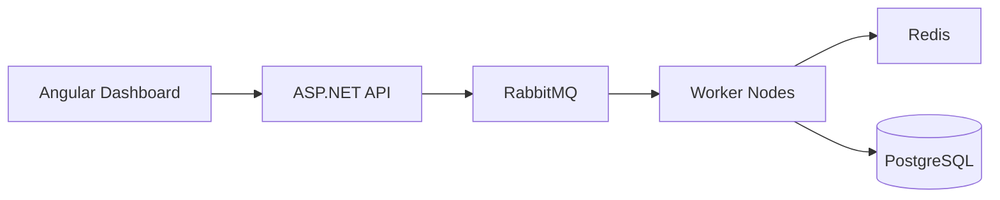

# ReliableBack

Distributed background job processing system for .NET.

ReliableBack is a custom-built background task processing platform inspired by Hangfire and Celery, 
focused on reliability, retry orchestration, distributed locking, observability, and horizontal scalability.

## Tech Stack

.NET 8 · ASP.NET Core · EF Core · Dapper · MediatR (CQRS) · RabbitMQ · Redis (RedLock, Pub/Sub) · PostgreSQL 
· SignalR · Angular · Docker Compose · OpenTelemetry · Serilog · xUnit · Testcontainers · GitHub Actions CI



## Why?

Most pet projects demonstrate CRUD operations.

ReliableBack focuses on real-world distributed systems challenges:

- Reliable background job execution
- Retry orchestration
- Distributed locking
- Horizontal scaling
- Worker coordination
- Dead-letter handling
- Job scheduling
- Real-time monitoring
- Observability and tracing

The goal of this project is to explore how systems like Hangfire, Celery, Sidekiq, and Temporal work internally.

## Features

- Distributed job processing
- Delayed and scheduled jobs
- Retry policies with exponential backoff
- Dead-letter queue support
- Worker heartbeat monitoring
- Redis-based distributed locking (RedLock)
- RabbitMQ-based message transport
- Real-time dashboard via SignalR
- OpenTelemetry tracing
- Structured logging with Serilog
- Horizontal worker scaling
- Docker Compose local environment
- Integration testing with Testcontainers

## Architecture

ReliableBack follows a modular distributed architecture:

- API Gateway — receives and schedules jobs
- Dispatcher — publishes jobs into RabbitMQ
- Worker Nodes — consume and execute jobs
- Scheduler — handles delayed jobs
- Retry Processor — requeues failed jobs
- Monitoring Service — tracks worker health
- Dashboard — real-time system monitoring

### Persistence

- PostgreSQL — job metadata and state
- Redis — distributed coordination and caching
- RabbitMQ — transport layer

## Reliability Guarantees

ReliableBack implements several reliability mechanisms:

- At-least-once delivery
- Idempotent job execution
- Distributed locking
- Retry with exponential backoff
- Dead-letter queues
- Worker heartbeat tracking
- Failure recovery
- Graceful shutdown handling

## Observability

The platform includes production-style observability:

- OpenTelemetry tracing
- Structured Serilog logging
- Correlation IDs
- Distributed tracing
- Metrics collection
- Real-time dashboard updates via SignalR

## Getting Started

### Prerequisites

- .NET 8 SDK
- Docker
- Docker Compose

### Run locally

```bash
docker compose up -d

dotnet restore

dotnet run --project src/ReliableBack.API


---

# 9. Docker section

```md id="z6mwt1"
## Local Infrastructure

Docker Compose starts:

- PostgreSQL
- RabbitMQ
- Redis
- Jaeger
- Seq

## Testing

Run unit and integration tests:

```bash
dotnet test


---

# 11. Future improvements

Дуже хороший сигнал для recruiters.

```md id="kp74w6"
## Roadmap

- [ ] Cron scheduling
- [ ] Priority queues
- [ ] Rate limiting
- [ ] Multi-tenant support
- [ ] Distributed workflow engine
- [ ] Kubernetes deployment
- [ ] Prometheus metrics